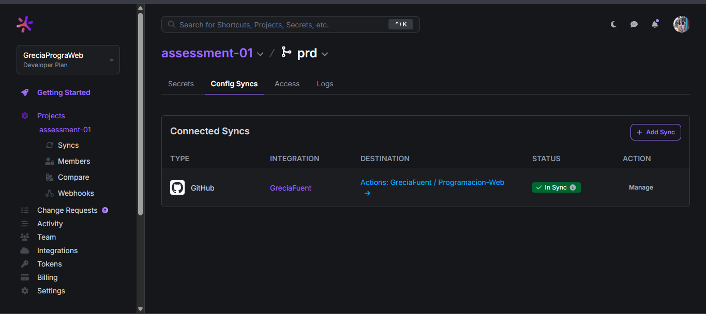
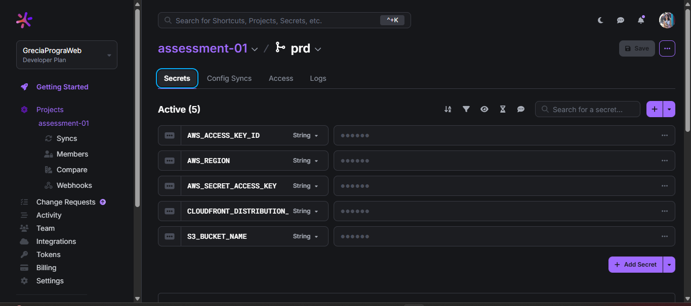
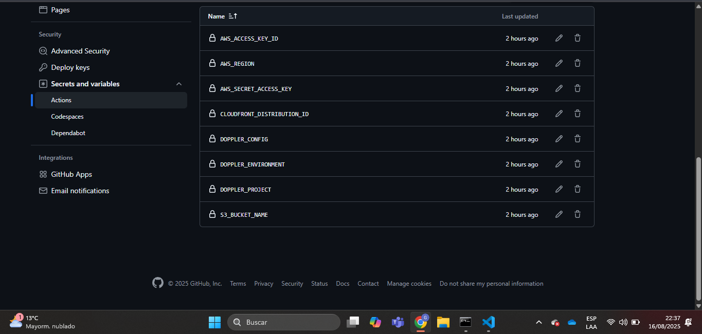
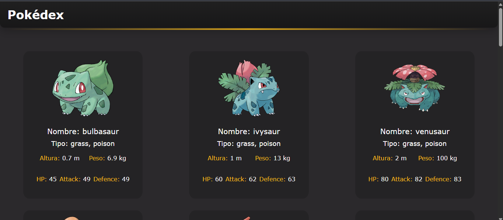
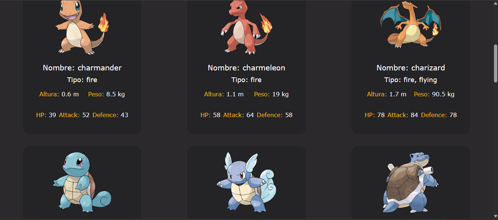

# Pokédex — Assessment 1

- **Doppler – Config Syncs (repo integration)**
  
  

- **Doppler – Variables**
  
  

- **GitHub → Actions – Secrets**
  
  

- **App running – Pokémon cards**
  
  
  

## Public CDN URL (CloudFront)

**URL:** https://d2hsi0je9qz1wd.cloudfront.net/